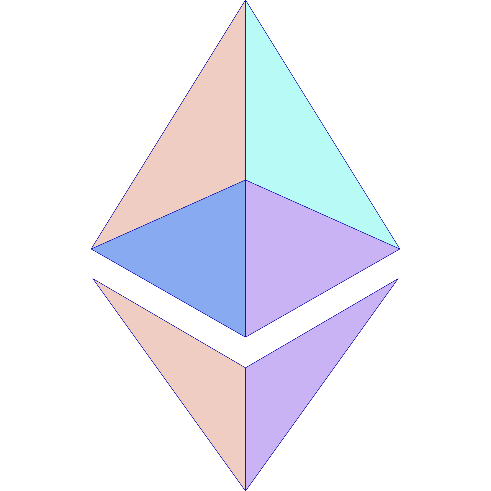

<p align="center">
  <br />
  
  <br/>
  <br />
  <p align="center">


</p>

<br/>

[](#table-of-contents)

<br/>

## • Overview

This project is made following [this instructions](https://app.unchain.tech/learn/ETH-NFT-Game/). Engineer cmmunity `UNCHAIN` is one of the best one to learn blockchain development.

This is dapp that you can play simple game on Ethereum blockchain. You can mint character NFT and battle with a boss character.

## • Links

[Deployed here](https://eth-nft-game-client.vercel.app/)

[](https://eth-nft-game-client.vercel.app/)

## • Launch

1. run `yarn install` in terminal.

2. make `.env` file under `packages/contract` and input your `Private Key` and `Alchemy HTTP Key` like below.

```
PRIVATE_KEY = <YOUR_PRIVATE_KEY>
STAGING_ALCHEMY_KEY = <ALCHEMY_HTTP_KEY>
```

3. run `yarn contract deploy` in terminal. The result would be like below.

```
Compiled 1 Solidity file successfully
Contract deployed to: 0x8ca0fF95BdD8c618DEAa0eE78Ef3A80bbBdecB83
```

4. change the line 1 in `packages/client/src/constants.js`.

```javascript
const CONTRACT_ADDRESS = '<YOUR_CONTRACT_ADDRESS>';
```

5. replace the json file in `packages/client/src/utils/Web3Mint.json` with the content of the json file in `packages/contract/artifacts/contracts/MyEpicGame.sol/MyEpicGame.json`.

6. Finally, run `yarn client start` in terminal and see how it works!
